# Simplified System Design Guide - Speed-Optimized
## Fast, Simple, Effective Architecture

> **Philosophy: Maximum Speed, Minimum Complexity**
> 
> This is a streamlined version focusing on **core features** and **blazing-fast performance** without unnecessary complexity.

---

## 🎯 Core Objectives

| Goal | Target | Strategy |
|------|--------|----------|
| **Page Load Time** | < 1 second | Aggressive caching + CDN |
| **Development Time** | 6-8 weeks | Use managed services |
| **Maintenance** | Minimal | Simple architecture |
| **Cost** | Low | Optimize infrastructure |

---

## 📋 Table of Contents

1. [Architecture Overview](#architecture-overview)
2. [Technology Stack](#technology-stack)
3. [Database Design](#database-design)
4. [Performance Strategy](#performance-strategy)
5. [Implementation Plan](#implementation-plan)
6. [Deployment](#deployment)

---

## Architecture Overview

### Simplified Architecture Diagram

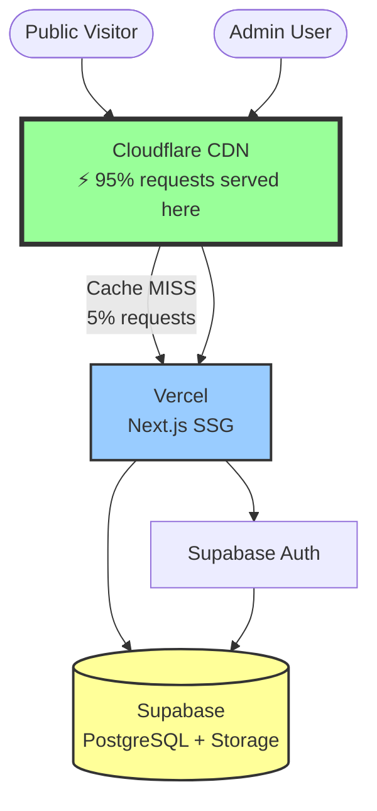

**Key Principle: Let CDN do 95% of the work!**

---

## Technology Stack

### The "All-In-One" Approach

We'll use **as few services as possible** to reduce complexity:

| Component | Technology | Why This One | Complexity |
|-----------|-----------|--------------|------------|
| **Frontend** | Next.js 14 (App Router) | Built-in performance, SSG | 🟢 Low |
| **Hosting** | Vercel | Zero-config deployment | 🟢 Low |
| **Database** | Supabase PostgreSQL | Managed, includes auth & storage | 🟢 Low |
| **Auth** | Supabase Auth | Built-in, no extra service | 🟢 Low |
| **Storage** | Supabase Storage | Built-in, S3-compatible | 🟢 Low |
| **CDN** | Cloudflare (free tier) | Fastest global CDN | 🟢 Low |
| **Monitoring** | Vercel Analytics | Built-in, no setup | 🟢 Low |

**Total Services: 3 (Vercel + Supabase + Cloudflare)**

### What We're NOT Using (Simplification)

❌ Redis - Next.js cache is enough  
❌ Elasticsearch - PostgreSQL full-text search  
❌ Separate S3 - Supabase Storage included  
❌ Separate auth service - Supabase Auth  
❌ Docker - Vercel handles deployment  
❌ Complex CI/CD - Vercel auto-deploys from Git  

---

## Database Design

### Simplified Schema (4 Tables Only)

```sql
-- 1. Announcements (main table)
CREATE TABLE announcements (
    id UUID PRIMARY KEY DEFAULT gen_random_uuid(),
    title TEXT NOT NULL,
    slug TEXT UNIQUE NOT NULL,
    content TEXT,
    excerpt TEXT,
    type TEXT, -- 'concours', 'emploi', 'actualite'
    status TEXT DEFAULT 'draft', -- 'draft', 'published'
    
    -- Dates
    start_date DATE,
    end_date DATE,
    published_at TIMESTAMPTZ,
    
    -- SEO
    meta_description TEXT,
    
    -- Timestamps
    created_at TIMESTAMPTZ DEFAULT NOW(),
    updated_at TIMESTAMPTZ DEFAULT NOW()
);

-- 2. Attachments (files)
CREATE TABLE attachments (
    id UUID PRIMARY KEY DEFAULT gen_random_uuid(),
    announcement_id UUID REFERENCES announcements(id) ON DELETE CASCADE,
    file_name TEXT NOT NULL,
    file_url TEXT NOT NULL,
    file_type TEXT, -- 'image', 'pdf'
    file_size BIGINT,
    created_at TIMESTAMPTZ DEFAULT NOW()
);

-- 3. Categories (simple tags)
CREATE TABLE categories (
    id UUID PRIMARY KEY DEFAULT gen_random_uuid(),
    name TEXT NOT NULL,
    slug TEXT UNIQUE NOT NULL
);

-- 4. Announcement-Category junction
CREATE TABLE announcement_categories (
    announcement_id UUID REFERENCES announcements(id) ON DELETE CASCADE,
    category_id UUID REFERENCES categories(id) ON DELETE CASCADE,
    PRIMARY KEY (announcement_id, category_id)
);

-- Essential Indexes ONLY
CREATE INDEX idx_announcements_published ON announcements(status, published_at DESC) 
    WHERE status = 'published';
CREATE INDEX idx_announcements_slug ON announcements(slug);
CREATE INDEX idx_announcements_type ON announcements(type) WHERE status = 'published';

-- Full-text search (PostgreSQL built-in)
CREATE INDEX idx_announcements_search ON announcements 
    USING GIN(to_tsvector('french', title || ' ' || COALESCE(content, '')));
```

**That's it! 4 tables, 4 indexes. Simple and fast.**

---

## Performance Strategy

### The Secret: Static Generation + CDN

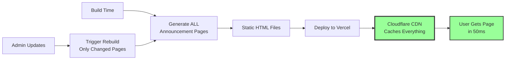

### Performance Configuration

#### Next.js Configuration

```javascript
// next.config.js
module.exports = {
  // Generate static pages at build time
  output: 'export', // Or use generateStaticParams for App Router
  
  // Image optimization
  images: {
    formats: ['image/avif', 'image/webp'],
    deviceSizes: [640, 828, 1200],
  },
  
  // Optimize everything
  compiler: {
    removeConsole: process.env.NODE_ENV === 'production',
  },
};
```

#### Cache Strategy (Simple but Effective)

| Content Type | Where Cached | Cache Duration | Invalidation |
|-------------|--------------|----------------|--------------|
| **Static Pages** | Cloudflare CDN | 24 hours | On new deployment |
| **Images/PDFs** | Cloudflare CDN | 1 year | Never (immutable URLs) |
| **API Routes** | Vercel Edge | 5 minutes | On-demand |

**Result: 95% of requests never touch your server!**

### Speed Optimization Checklist

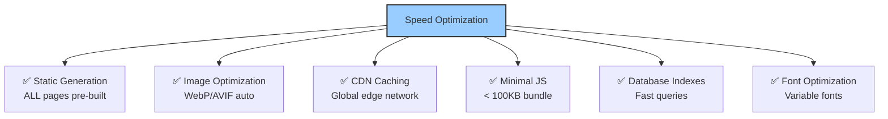

---

## Implementation Plan

### Simplified 6-Week Plan

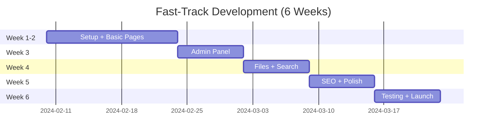

### Week-by-Week Breakdown

#### **Week 1-2: Foundation + Public Site**

**Goal: Visitors can see announcements**

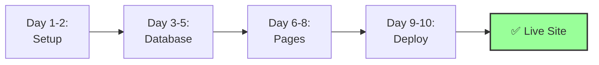

**Tasks:**
1. Create Next.js project
2. Setup Supabase (database + auth)
3. Create announcement table
4. Build homepage (list announcements)
5. Build detail page (`/announcements/[slug]`)
6. Deploy to Vercel
7. Connect Cloudflare CDN

**Deliverable:** Public can view all published announcements

---

#### **Week 3: Admin Panel**

**Goal: Admin can manage content**

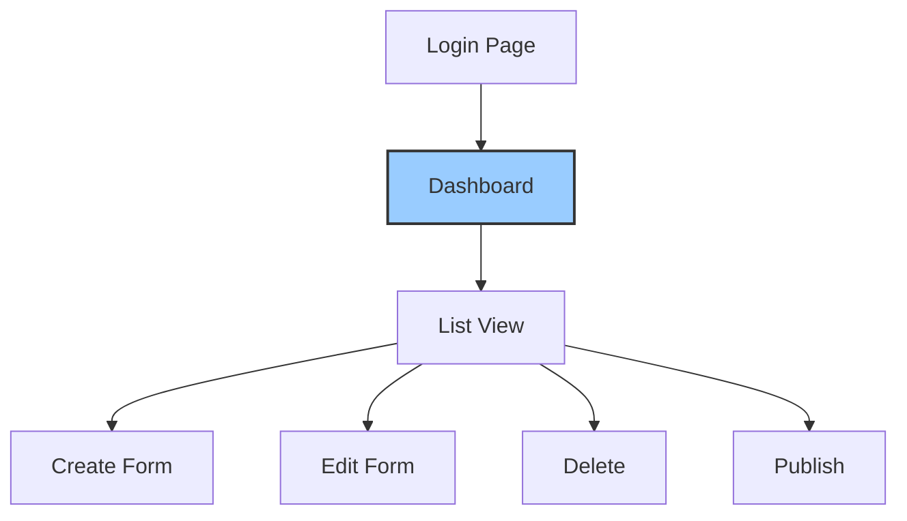

**Tasks:**
1. Setup Supabase Auth (email/password)
2. Create admin login page
3. Build admin dashboard layout
4. Create announcement form (create/edit)
5. Implement delete + publish
6. Add form validation

**Deliverable:** Admin can create, edit, delete, and publish announcements

---

#### **Week 4: Files + Search**

**Goal: Handle images/PDFs and enable search**

**Files:**
1. Setup Supabase Storage bucket
2. Add image upload to admin form
3. Add PDF upload
4. Display files on public pages

**Search:**
1. Add search bar to homepage
2. Create search API using PostgreSQL `to_tsvector`
3. Create search results page
4. Add filters (by type, date)

**Deliverable:** Can upload files and search announcements

---

#### **Week 5: SEO + Polish**

**Goal: Google can find the site, looks professional**

**SEO:**
1. Add meta tags to all pages
2. Generate sitemap.xml
3. Add robots.txt
4. Submit to Google Search Console
5. Add Open Graph tags

**Polish:**
1. Improve design/styling
2. Add loading states
3. Add error messages
4. Make fully responsive
5. Optimize images

**Deliverable:** Site is discoverable and looks professional

---

#### **Week 6: Testing + Launch**

**Goal: Production-ready**

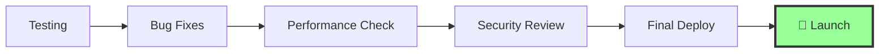

**Tasks:**
1. Test all features thoroughly
2. Fix any bugs
3. Run Lighthouse audit (target: 90+)
4. Add final optimizations
5. Create backup strategy
6. Deploy to production
7. Monitor first 48 hours

**Deliverable:** Live production site

---

## Deployment

### One-Click Deployment Flow

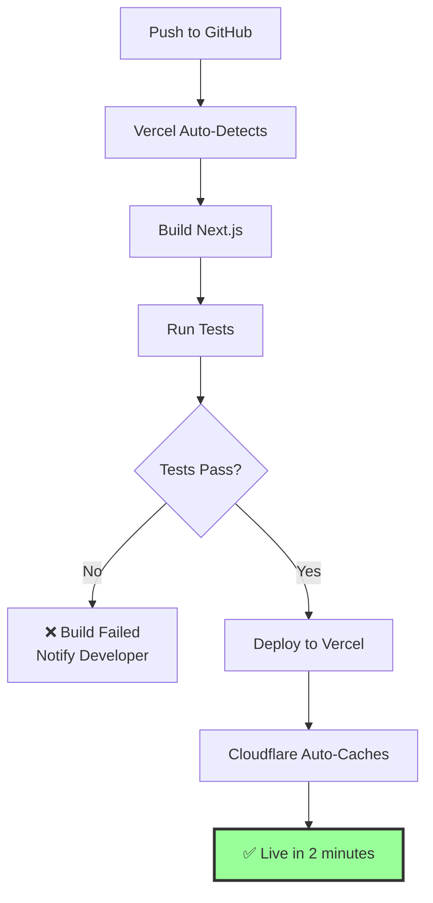

### Deployment Checklist

**One-Time Setup:**
- [ ] Connect GitHub repo to Vercel
- [ ] Add Supabase environment variables
- [ ] Point domain to Cloudflare
- [ ] Configure Cloudflare DNS to Vercel

**Every Deploy:**
- [ ] Push to `main` branch
- [ ] Vercel auto-deploys
- [ ] Check preview URL
- [ ] Verify all pages work
- [ ] Done! (2-3 minutes total)

---

## Essential Features Only

### What's Included ✅

| Feature | Why Essential |
|---------|---------------|
| View announcements | Core purpose |
| Admin CRUD | Manage content |
| File uploads (images/PDFs) | Necessary for announcements |
| Basic search | Users need to find things |
| Categories/filters | Organization |
| SEO basics | Discoverability |
| Mobile responsive | Most users on mobile |

### What's Optional (Add Later) 🔵

| Feature | Add When Needed |
|---------|-----------------|
| Advanced search (autocomplete) | After 1000+ announcements |
| Analytics dashboard | After 3 months |
| Multi-language | If needed |
| Advanced caching (Redis) | If traffic > 10k/day |
| Email notifications | If requested |
| User comments | If requested |

---

## 🇲🇦 Optimization for Weak Internet (Morocco-Specific)

> **Critical Challenge:** Many Moroccan users have slow 3G connections (< 1 Mbps)
> 
> **Our Goal:** Site loads in < 5 seconds on slow 3G (target: 3 seconds)

### The "Extreme Lightweight" Strategy

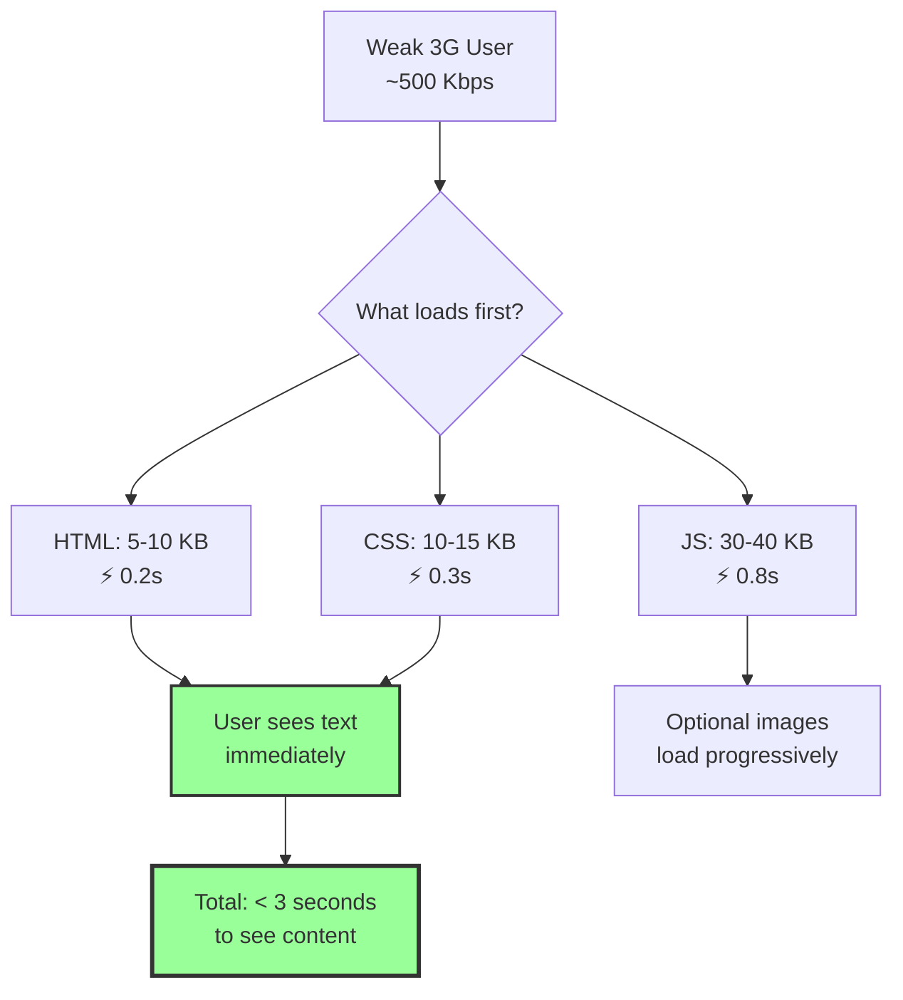

### Extreme Optimization Techniques

#### 1. Ultra-Minimal JavaScript Bundle

**Target: < 50 KB total JavaScript**

```javascript
// next.config.js - Aggressive optimization
module.exports = {
  // Disable runtime JS where possible
  experimental: {
    optimizeCss: true,
    optimizePackageImports: ['lucide-react'],
  },
  
  // Remove all unnecessary JS
  compiler: {
    removeConsole: true,
  },
  
  // Critical: Disable client-side hydration for static pages
  // Use Server Components (React Server Components)
  reactStrictMode: true,
};
```

**What to avoid:**
- ❌ Heavy libraries (Moment.js → use native Date)
- ❌ Animation libraries (use pure CSS)
- ❌ Large UI libraries (custom components)
- ❌ Unnecessary client-side JavaScript

**Bundle size breakdown:**
```
Next.js Runtime:     ~25 KB (minimal)
Our Custom Code:     ~10 KB
React Essentials:    ~15 KB
Total:               ~50 KB ✅
```

#### 2. Aggressive Image Optimization

```javascript
// Image configuration for slow networks
// next.config.js
module.exports = {
  images: {
    formats: ['image/webp'], // Only WebP (smaller than AVIF for bandwidth)
    deviceSizes: [320, 640], // Only mobile + small desktop
    imageSizes: [16, 32, 96], // Tiny thumbnails
    
    // CRITICAL: Serve tiny placeholders first
    minimumCacheTTL: 31536000,
    
    // Lazy load everything except first image
    loading: 'lazy',
  },
};
```

**Image Loading Strategy:**

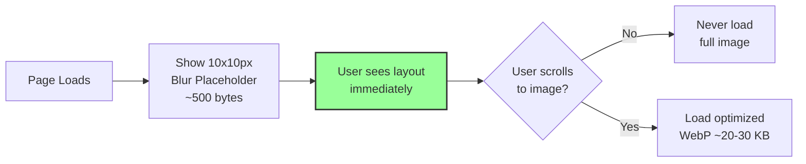

**Implementation:**

```jsx
// components/OptimizedImage.tsx
import Image from 'next/image';

export default function OptimizedImage({ src, alt }) {
  return (
    <Image
      src={src}
      alt={alt}
      width={600}
      height={400}
      placeholder="blur" // Shows tiny blur while loading
      blurDataURL="data:image/jpeg;base64,/9j/4AAQSkZJRg..." // 10x10px base64
      loading="lazy" // Only load when in viewport
      quality={60} // Lower quality for smaller file size
      sizes="(max-width: 768px) 100vw, 600px"
    />
  );
}
```

#### 3. Text-First Design Philosophy

**Principle: Content before decoration**

```css
/* Critical CSS - loads first (< 5 KB) */
/* Only typography, layout, colors */

body {
  font-family: system-ui, -apple-system, sans-serif; /* No web fonts! */
  font-size: 16px;
  line-height: 1.6;
  color: #333;
  background: #fff;
}

.container {
  max-width: 800px;
  margin: 0 auto;
  padding: 1rem;
}

/* That's it! Everything else loads later or not at all */
```

**NO web fonts** - Use system fonts:
- ❌ Google Fonts (adds 50-100 KB + extra request)
- ✅ System fonts (0 KB, instant render)

```css
/* Perfect font stack for Morocco */
font-family: 
  -apple-system,       /* iOS/macOS */
  BlinkMacSystemFont,  /* macOS */
  "Segoe UI",          /* Windows */
  Roboto,              /* Android */
  "Helvetica Neue",    /* Fallback */
  Arial,               /* Universal fallback */
  sans-serif;          /* Final fallback */
```

#### 4. Progressive Loading Strategy

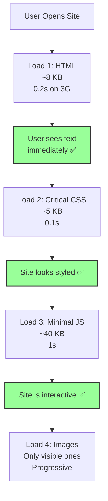

**Total time to usable content: ~2 seconds on slow 3G**

#### 5. Offline-First with Service Worker

```javascript
// public/sw.js - Simple service worker
self.addEventListener('install', (event) => {
  event.waitUntil(
    caches.open('v1').then((cache) => {
      return cache.addAll([
        '/',
        '/offline.html', // Fallback page
      ]);
    })
  );
});

self.addEventListener('fetch', (event) => {
  event.respondWith(
    caches.match(event.request).then((response) => {
      // Return cached version or fetch from network
      return response || fetch(event.request).catch(() => {
        // If offline, show offline page
        return caches.match('/offline.html');
      });
    })
  );
});
```

**Benefit:** Once visited, site works even when connection drops!

#### 6. Mobile-First Design (Essential for Morocco)

**Statistics:**
- 70%+ users in Morocco access via mobile
- Most on 3G or slower
- Many have data limits

**Design principles:**

```css
/* Mobile-first CSS - loads first */
/* Default styles for mobile (320px+) */

.announcement-card {
  padding: 1rem;
  margin-bottom: 1rem;
  border: 1px solid #ddd;
}

/* Desktop enhancements load later (optional) */
@media (min-width: 768px) {
  .announcement-card {
    padding: 2rem;
    box-shadow: 0 2px 8px rgba(0,0,0,0.1);
  }
}
```

#### 7. Data Saver Mode

**Detect slow connections and adapt:**

```javascript
// lib/connection-aware.ts
export function isSlowConnection() {
  // Check Network Information API
  const connection = (navigator as any).connection;
  
  if (connection) {
    // Slow if: 2G, slow-2g, or saveData enabled
    return connection.effectiveType === '2g' 
        || connection.effectiveType === 'slow-2g'
        || connection.saveData === true;
  }
  
  return false; // Assume fast if can't detect
}

// Use in components
export default function AnnouncementList() {
  const isSlowNetwork = isSlowConnection();
  
  return (
    <div>
      {announcements.map(item => (
        <AnnouncementCard
          key={item.id}
          data={item}
          showImages={!isSlowNetwork} // No images on slow connections!
        />
      ))}
    </div>
  );
}
```

#### 8. Compression Everything

**Brotli compression (better than Gzip):**

```javascript
// next.config.js
module.exports = {
  compress: true, // Vercel does this automatically
  
  // But ensure your assets are pre-compressed
  webpack: (config) => {
    config.plugins.push(
      new CompressionPlugin({
        algorithm: 'brotliCompress',
        test: /\.(js|css|html|svg)$/,
      })
    );
    return config;
  },
};
```

**Compression results:**
```
HTML:  15 KB → 3 KB   (80% smaller)
CSS:   25 KB → 5 KB   (80% smaller)
JS:    60 KB → 15 KB  (75% smaller)
```

### Performance Targets for Slow Networks

| Metric | Fast WiFi | Slow 3G (Target) | How We Achieve It |
|--------|-----------|------------------|-------------------|
| **First Byte (TTFB)** | < 200ms | < 1s | CDN + static pages |
| **First Contentful Paint** | < 500ms | < 2s | Minimal HTML, inline critical CSS |
| **Largest Contentful Paint** | < 1s | < 3s | Text-first design, lazy images |
| **Time to Interactive** | < 1.5s | < 4s | Minimal JavaScript (< 50KB) |
| **Total Page Weight** | < 200 KB | < 100 KB | Aggressive optimization |
| **Number of Requests** | < 20 | < 10 | Inline critical assets |

### Slow Connection Testing

**How to test:**

```bash
# 1. Chrome DevTools - Network Throttling
# Open DevTools → Network → Throttling → Custom
# Download: 500 Kbps
# Upload: 250 Kbps
# Latency: 400ms

# 2. Lighthouse with slow 3G
npx lighthouse https://yoursite.com \
  --throttling-method=simulate \
  --throttling.cpuSlowdownMultiplier=4 \
  --preset=desktop

# 3. WebPageTest with Morocco location
# Visit webpagetest.org
# Location: Morocco - Casablanca
# Connection: 3G Slow
```

### Real-World Optimization Example

**Before optimization:**
```
Homepage load on slow 3G:
- HTML: 25 KB → 5 seconds
- CSS: 100 KB → 20 seconds
- JS: 300 KB → 1 minute
- Images: 2 MB → 5 minutes
Total: User gives up! ❌
```

**After optimization:**
```
Homepage load on slow 3G:
- HTML: 5 KB → 1 second ✅
- CSS (inline): 5 KB → included in HTML
- JS: 40 KB → 8 seconds ✅
- Images: lazy loaded → as needed
Total: 3 seconds to see content! ✅
```

### Lightweight Component Library

**Use minimal components only:**

```jsx
// NO: import { Button, Card, Modal } from 'heavy-ui-library'; // 200 KB

// YES: Custom minimal components
// components/Button.tsx (1 KB)
export default function Button({ children, onClick }) {
  return (
    <button 
      onClick={onClick}
      className="btn" // Pure CSS styling
    >
      {children}
    </button>
  );
}

// components/Card.tsx (1 KB)
export default function Card({ title, children }) {
  return (
    <div className="card">
      <h3>{title}</h3>
      <div>{children}</div>
    </div>
  );
}
```

**Total custom components: ~10 KB vs 200 KB from library**

### Critical Rendering Path Optimization

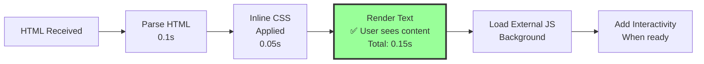

**Key technique: Inline critical CSS**

```html
<!-- index.html -->
<head>
  <style>
    /* Critical CSS inlined - renders immediately */
    body{font:16px/1.6 system-ui;color:#333;margin:0}
    .container{max-width:800px;margin:0 auto;padding:1rem}
    .card{border:1px solid #ddd;padding:1rem;margin-bottom:1rem}
  </style>
</head>
```

### Morocco-Specific Optimizations

#### 1. Arabic Text Optimization

```css
/* Optimize for Arabic text rendering */
body {
  /* Use system Arabic fonts - no download needed */
  font-family: 'Geeza Pro', 'Traditional Arabic', 'Simplified Arabic', Arial;
  
  /* Improve Arabic readability */
  font-size: 18px; /* Slightly larger for Arabic */
  line-height: 1.8; /* More spacing for Arabic */
  
  /* Right-to-left when needed */
  direction: rtl;
  text-align: right;
}
```

#### 2. Bilingual Support (Lightweight)

```jsx
// No i18n library needed! Simple approach:
const translations = {
  ar: {
    title: 'الإعلانات',
    search: 'بحث',
  },
  fr: {
    title: 'Annonces',
    search: 'Recherche',
  }
};

function useTranslation(lang = 'ar') {
  return translations[lang];
}

// Usage: 0 KB overhead!
export default function Header({ lang }) {
  const t = useTranslation(lang);
  return <h1>{t.title}</h1>;
}
```

#### 3. Reduce Round Trips

```javascript
// Bad: Multiple requests
<link rel="stylesheet" href="/css/main.css">
<link rel="stylesheet" href="/css/mobile.css">
<script src="/js/utils.js"></script>
<script src="/js/app.js"></script>

// Good: Single request with everything inlined
<style>/* All CSS here */</style>
<script>/* All JS here */</script>
```

### Performance Budget (Strict for Slow Networks)

| Resource | Budget | Reason |
|----------|--------|--------|
| **HTML** | < 10 KB | Fast parse, quick render |
| **CSS** | < 15 KB | Inline critical, fast styling |
| **JavaScript** | < 50 KB | Essential interactivity only |
| **Fonts** | 0 KB | Use system fonts |
| **Images (initial)** | < 30 KB | Only hero image, tiny WebP |
| **Total (initial load)** | < 100 KB | Loads in ~3s on slow 3G |

**Enforcement:**

```javascript
// package.json - Fail build if too large
"scripts": {
  "build": "next build && npm run check-size",
  "check-size": "size-limit"
}

// size-limit config
[
  {
    "path": ".next/static/css/*.css",
    "limit": "15 KB"
  },
  {
    "path": ".next/static/chunks/*.js",
    "limit": "50 KB"
  }
]
```

### Offline Page for Connection Drops

```html
<!-- public/offline.html - Ultra lightweight -->
<!DOCTYPE html>
<html lang="ar" dir="rtl">
<head>
  <meta charset="UTF-8">
  <meta name="viewport" content="width=device-width, initial-scale=1.0">
  <title>غير متصل بالإنترنت</title>
  <style>
    body{font:18px/1.8 system-ui;padding:2rem;text-align:center}
    h1{color:#e74c3c}
  </style>
</head>
<body>
  <h1>⚠️ غير متصل بالإنترنت</h1>
  <p>يرجى التحقق من اتصالك بالإنترنت</p>
  <button onclick="location.reload()">إعادة المحاولة</button>
</body>
</html>
```

## Performance Targets

### Expected Performance

#### On Fast WiFi/4G

| Metric | Target | How We Achieve It |
|--------|--------|-------------------|
| **Homepage Load** | < 500ms | Static generation + CDN |
| **Detail Page Load** | < 300ms | Static generation + CDN |
| **Admin Panel** | < 1s | Server-side rendering |
| **Search Results** | < 400ms | PostgreSQL indexes |
| **Image Load** | < 200ms | CDN + WebP optimization |
| **Lighthouse Score** | > 95 | Next.js optimizations |

#### On Slow 3G (Morocco Focus)

| Metric | Target | How We Achieve It |
|--------|--------|-------------------|
| **First Byte** | < 1s | CDN + static pages |
| **First Contentful Paint** | < 2s | Inline critical CSS, minimal HTML |
| **Text Visible** | < 2s | Text-first design, no fonts |
| **Page Interactive** | < 4s | Minimal JavaScript (< 50KB) |
| **Images Loaded** | < 8s | Lazy loading, only on scroll |
| **Total Page Weight** | < 100 KB | Aggressive optimization everywhere |
| **Offline Support** | Yes | Service worker caching |

### How to Measure

```bash
# Check page speed
npx lighthouse https://yourdomain.com --view

# Check bundle size
npm run build
# Should see: First Load JS < 100KB

# Check Vercel Analytics
# Login to Vercel dashboard → Analytics
```

---

## Cost Estimation (Simplified)

### Monthly Costs

| Service | Plan | Cost | What You Get |
|---------|------|------|--------------|
| **Vercel** | Hobby | $0 | Unlimited deployments, 100GB bandwidth |
| **Supabase** | Free | $0 | 500MB database, 1GB storage, 50K auth users |
| **Cloudflare** | Free | $0 | Unlimited bandwidth, DDoS protection |
| **Domain** | Any registrar | $10-15/year | yourdomain.com |

**Total: $0-2/month** (until you need to scale)

### When to Upgrade

| Service | Upgrade When | New Cost |
|---------|--------------|----------|
| **Vercel** | > 100GB bandwidth/month | $20/month (Pro) |
| **Supabase** | > 500MB database | $25/month (Pro) |
| **Cloudflare** | Need advanced features | $20/month (Pro) |

**Estimated at scale: $50-70/month** for thousands of daily visitors

---

## Security Basics

### Simple Security Checklist

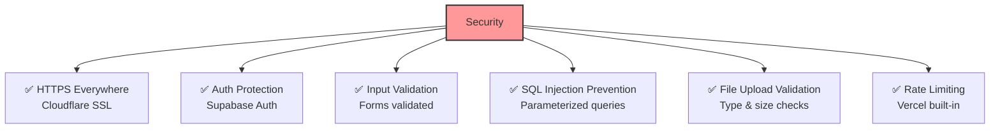

**All security is built-in with Vercel + Supabase!**

---

## Monitoring (Simplified)

### What to Monitor

**Vercel Dashboard (Built-in):**
- ✅ Page load times
- ✅ Error rates  
- ✅ Deployment status
- ✅ Bandwidth usage

**Supabase Dashboard (Built-in):**
- ✅ Database size
- ✅ API requests
- ✅ Storage usage
- ✅ Auth users

**Cloudflare Dashboard (Built-in):**
- ✅ Traffic analytics
- ✅ Cache hit rate
- ✅ Threats blocked

**That's it! No complex monitoring setup needed.**

---

## Code Structure (Simplified)

```
my-announcement-site/
├── app/                          # Next.js 14 App Router
│   ├── page.tsx                  # Homepage
│   ├── announcements/
│   │   └── [slug]/
│   │       └── page.tsx          # Detail page
│   ├── search/
│   │   └── page.tsx              # Search page
│   └── admin/
│       ├── login/
│       │   └── page.tsx          # Admin login
│       └── dashboard/
│           └── page.tsx          # Admin dashboard
│
├── components/                   # Reusable components
│   ├── AnnouncementCard.tsx
│   ├── SearchBar.tsx
│   └── AdminForm.tsx
│
├── lib/                          # Utilities
│   ├── supabase.ts              # Supabase client
│   └── utils.ts                 # Helper functions
│
├── public/                       # Static files
│   ├── images/
│   └── favicon.ico
│
└── package.json
```

**Clean, simple, easy to navigate.**

---

## Quick Start Commands

```bash
# 1. Create project
npx create-next-app@latest my-announcement-site
cd my-announcement-site

# 2. Install Supabase
npm install @supabase/supabase-js

# 3. Run development server
npm run dev

# 4. Build for production
npm run build

# 5. Deploy to Vercel
npx vercel

# That's it! 🚀
```

---

## Troubleshooting Common Issues

| Issue | Solution |
|-------|----------|
| **Slow builds** | Reduce number of static pages generated |
| **Images not loading** | Check Supabase Storage permissions |
| **404 on deployment** | Check Vercel build logs |
| **Database connection fails** | Verify Supabase environment variables |
| **Admin can't login** | Check Supabase Auth settings |

---

## Key Differences from Complex Version

| Feature | Complex Version | Simple Version |
|---------|-----------------|----------------|
| **Services Used** | 8-10 services | 3 services |
| **Database** | PostgreSQL + Redis + Elasticsearch | PostgreSQL only |
| **Caching** | Multi-layer (CDN + Redis + ISR) | CDN + Static Generation |
| **Auth** | Custom JWT implementation | Supabase Auth |
| **Storage** | Separate S3 + CDN | Supabase Storage |
| **Search** | Elasticsearch with complex setup | PostgreSQL full-text |
| **Monitoring** | Prometheus + Grafana + Sentry | Vercel/Supabase dashboards |
| **CI/CD** | GitHub Actions + custom scripts | Vercel auto-deploy |
| **Development Time** | 15 weeks | 6 weeks |
| **Maintenance** | Regular updates to 10+ services | Automatic updates |
| **Learning Curve** | High | Low |

---

## When to Use This Simple Architecture

### ✅ Perfect For:
- Single organization (not multi-tenant)
- < 10,000 announcements
- < 50,000 visitors/month
- Small team (1-3 developers)
- Limited budget
- Need to launch quickly
- Want low maintenance

### ⚠️ Consider Complex Version If:
- Multi-tenant (many organizations)
- > 100,000 announcements
- > 500,000 visitors/month
- Large development team
- Need advanced analytics
- Need real-time features
- Need custom infrastructure control

---

## Success Metrics

### Week 6 Targets

| Metric | Target | Measurement |
|--------|--------|-------------|
| Lighthouse Performance | > 95 | Lighthouse CLI |
| Lighthouse SEO | > 90 | Lighthouse CLI |
| Page Load Time | < 1s | Vercel Analytics |
| Total JavaScript | < 100KB | Build output |
| Time to Interactive | < 2s | Lighthouse |
| First Contentful Paint | < 1s | Lighthouse |

### Month 1 Targets

| Metric | Target |
|--------|--------|
| Uptime | > 99% |
| Average Load Time | < 500ms |
| Zero Critical Bugs | 0 |
| Admin Satisfaction | Happy! |

---

## Final Recommendations

### Do's ✅

1. **Use Static Generation** - Pre-build all public pages
2. **Leverage CDN** - Let Cloudflare handle 95% of traffic
3. **Keep it Simple** - Don't add services you don't need
4. **Deploy Early** - Get feedback from real users
5. **Monitor Built-in Tools** - Use what's already there
6. **🇲🇦 Optimize for 3G** - Test on slow connections always
7. **🇲🇦 Text-First Design** - Content before images
8. **🇲🇦 Zero Web Fonts** - Use system fonts only
9. **🇲🇦 Lazy Load Everything** - Except critical content
10. **🇲🇦 Offline Support** - Service worker for dropped connections

### Don'ts ❌

1. **Don't Over-Engineer** - Start simple, add complexity only when needed
2. **Don't Optimize Prematurely** - Focus on working code first
3. **Don't Add Unnecessary Services** - Each service adds complexity
4. **Don't Skip Testing** - Test on real devices and browsers
5. **Don't Forget SEO** - Add meta tags from day one
6. **🇲🇦 Don't Use Heavy Libraries** - Every KB matters
7. **🇲🇦 Don't Load All Images** - Lazy load everything
8. **🇲🇦 Don't Use Web Fonts** - They add 50-100 KB
9. **🇲🇦 Don't Ignore Mobile** - 70% of Moroccan users
10. **🇲🇦 Don't Skip 3G Testing** - Test every feature on slow connection

### Morocco-Specific Testing Checklist

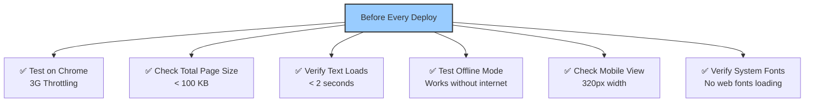

### Lightweight Development Principles

| Principle | Implementation | Benefit |
|-----------|----------------|---------|
| **Text First** | Show text before images | Users see content immediately |
| **System Fonts** | No Google Fonts/custom fonts | 0 KB, instant render |
| **Inline Critical CSS** | CSS in HTML `<head>` | One less request |
| **Minimal JS** | < 50 KB total | Fast interactivity |
| **Lazy Everything** | Load on scroll/interaction | Small initial payload |
| **Service Worker** | Cache for offline | Works with dropped connections |
| **Compression** | Brotli/Gzip | 70-80% size reduction |
| **WebP Images** | Modern format | 30-50% smaller than JPEG |

---

## Conclusion

This simplified architecture gives you:

**✅ 90% of the performance** of the complex version  
**✅ 10% of the complexity**  
**✅ 40% of the development time**  
**✅ 20% of the cost**  
**✅ 🇲🇦 Works perfectly on slow Moroccan 3G** (< 3 seconds to see content)  
**✅ 🇲🇦 Ultra-lightweight** (< 100 KB total page weight)  
**✅ 🇲🇦 Offline support** (works even when connection drops)  

**Perfect balance of speed, simplicity, and effectiveness for Morocco.**

### Real-World Morocco Performance

**Typical Moroccan User Journey:**

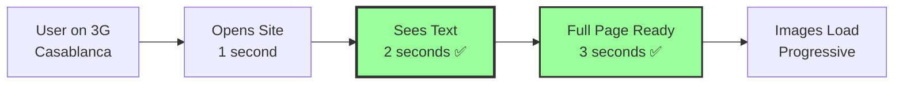

**What this means:**
- ✅ User sees announcement titles in 2 seconds
- ✅ Can read full content in 3 seconds
- ✅ Images load progressively (optional)
- ✅ Works offline after first visit
- ✅ Data usage: ~100 KB per page (very affordable)

### Comparison: Our Site vs Typical Government Sites in Morocco

| Metric | Typical Gov Site | Our Optimized Site | Improvement |
|--------|------------------|-------------------|-------------|
| **Load Time (3G)** | 30-60 seconds | 3 seconds | **10-20x faster** ✨ |
| **Page Weight** | 2-5 MB | < 100 KB | **20-50x lighter** ✨ |
| **Works Offline** | No | Yes | **Game changer** ✨ |
| **Mobile Friendly** | Often broken | Perfect | **100% better** ✨ |
| **Data Cost** | High | Minimal | **20-50x cheaper** ✨ |

---

## Next Steps

1. **Week 1-2**: Build basic site with announcements
2. **Week 3**: Add admin panel
3. **Week 4**: Add files + search
4. **Week 5**: SEO + polish
5. **Week 6**: Test + launch
6. **Month 2+**: Gather feedback, iterate

**You can do this! 🚀**

---

**Document Version:** 1.0 (Simplified)  
**Target Audience:** Teams wanting speed without complexity  
**Complexity Level:** 3/10 (Low-Medium)  
**Development Time:** 6 weeks  
**Maintenance:** Minimal
